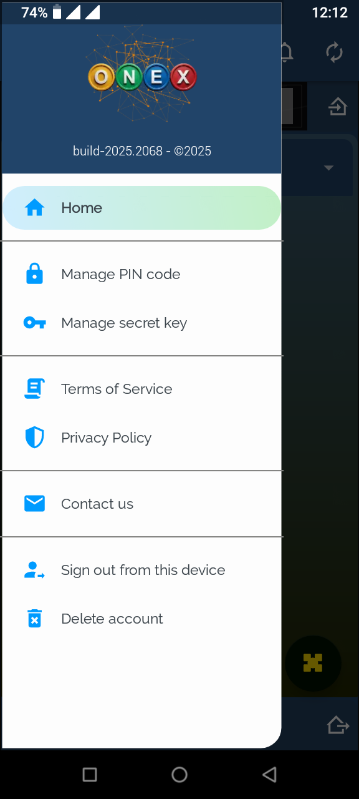
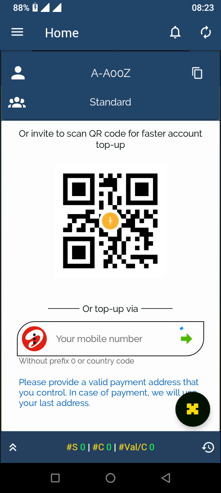
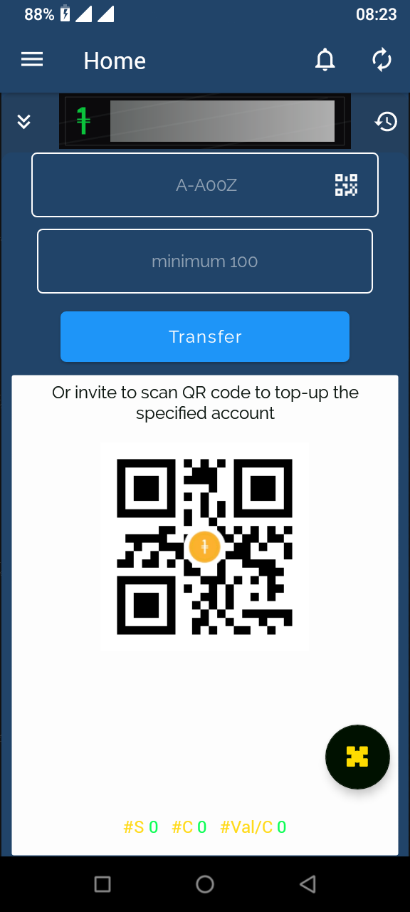

# 🌍 OneX

**Slogan: Community – Exchange – Interest**

OneX is an open-source Android platform for hybrid digital currency. It is powered by **OneVal**, a unit primarily backed by USDT while reflecting the economic weight of the Malagasy local currency. This innovative system bridges global stability with local relevance.

## 🚀 Key Features

- **Buy and sell assets** directly through the platform or peer-to-peer
- **Integrated mobile payments** for fast and accessible transactions
- **Smart asset management** that’s secure and user-friendly
- **Fair redistribution system** promoting progressive resource balance

## 🌐 Vision

OneX represents a new generation of financial innovation, driven by real-time community activity. Its core mission is to **build a powerful and independent community**, especially across Africa, through a self-sustaining and equitable redistribution model.

## 📱 Platform

- Built for Android
- Open-source and community-driven
- Public launch coming soon

## 🖼️ App Screenshots

Here are some preview sections for showcasing the app interface:

### 📸 Home Screen

### 📸 Mobile Payment Module

### 📸 Making profits by joining an active session

### 📸 Sell or transfer to another user account

## 🤝 Join the Movement

OneX is more than just an app—it's a movement. By combining technology, financial inclusion, and community engagement, we’re building an ecosystem where every user becomes a catalyst for change.

---
